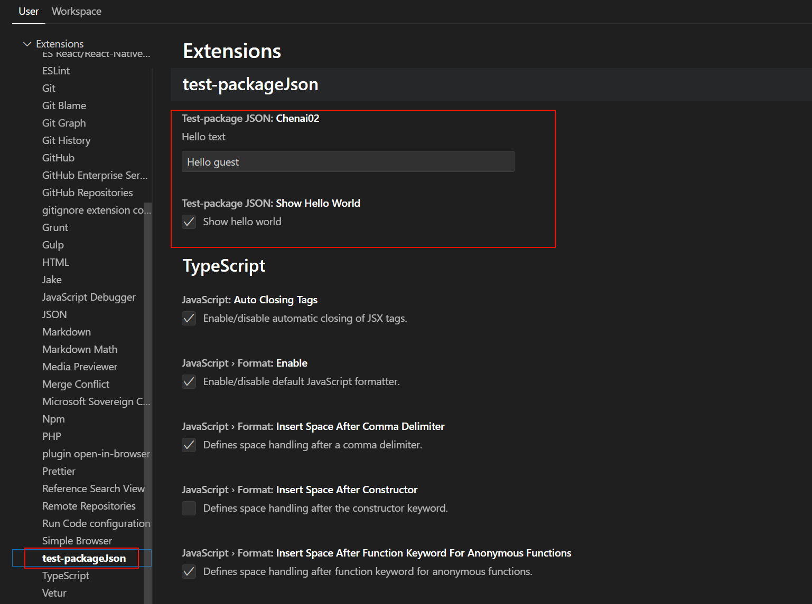
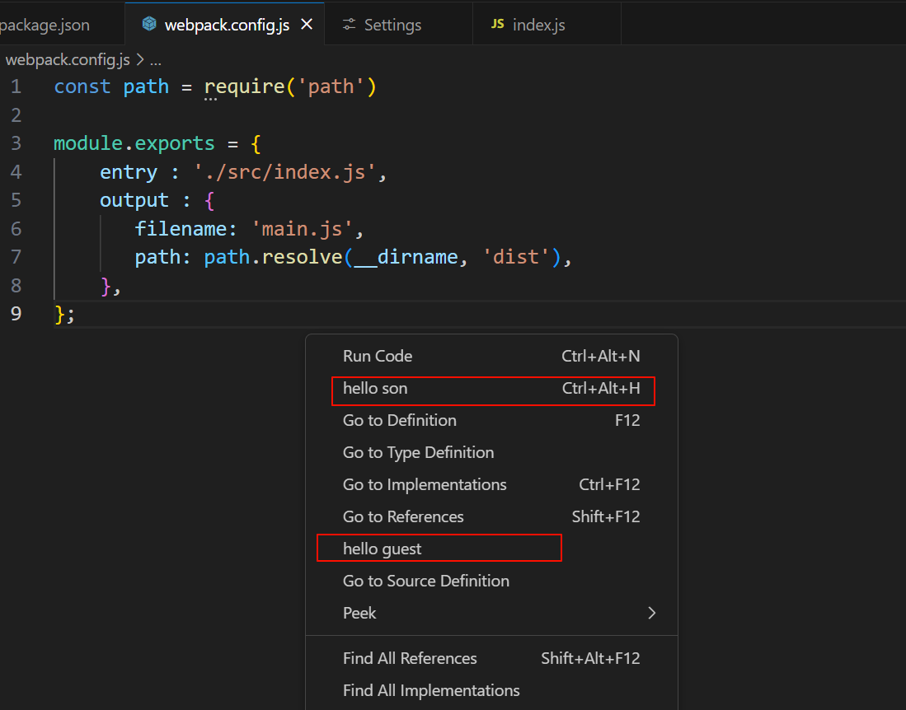
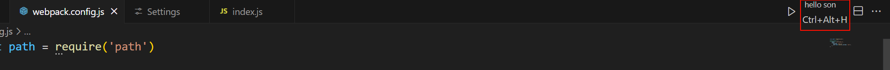
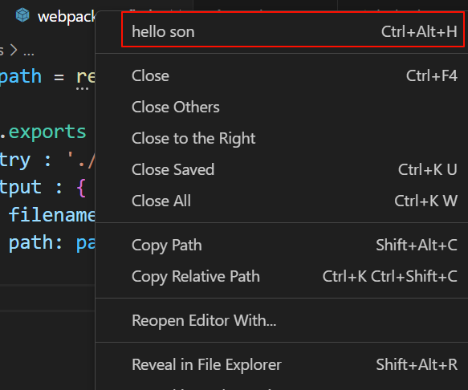

## vscode插件之package.json解析

所有注册的指令必须要在`contributes`的`commands`中注册。

### 1. configuration

最终展示位置在`setting`的`Extensions`中。

```json
"configuration": {
      "title": "packageJson",
      "properties": {
        "packageJson.chenai02": {
          "type": "string",
          "default": "Hello guest",
          "description": "Hello text"
        },
        "packageJson.showHelloWorld": {
          "type": "boolean",
          "default": true,
          "description": "Show hello world"
        }
      }
},
```

最终展示效果如图所示。

<div style="text-align:center;">
    
</div>

### 2. keybindings

绑定一个快捷键

```json
    "keybindings": [
      {
        "command": "packageJson-son",
        "key": "ctrl+alt+h",
        "mac": "cmd+alt+h",
        "when": "editorTextFocus"
      }
    ],
```

### 3. 菜单memu

#### editor/context

编辑器区域的右键菜单，`@1`表示排序级别。

```json
"editor/context": [
        {
          "command": "packageJson-son",
          "when": "editorFocus",
          "group": "navigation@1"
        },
        {
          "command": "packageJson-guest",
          "when": "editorFocus",
          "group": "navigation@2"
        }
      ],
```

<div style="text-align:center;">
    
</div>

#### editor/title

在编辑器区域的标题位置显示，如果不设置`icon`属性，就直接显示文字，当语言为`javascript`时显示。

```json
"editor/title": [
        {
          "command": "packageJson-son",
          "when": "editorFocus && resourceLangId  == javascript",
          "group": "navigation"
        }
      ],
```

<div style="text-align:center;">
    
</div>

#### editor/title/context

右键编辑器区域的标题时且当前语言是`javascript`时触发，

```json
"editor/title/context": [
        {
          "command": "packageJson-son",
          "when": "resourceLangId  == javascript",
          "group": "navigation"
        }
      ]
```

<div style="text-align:center;">
    
</div>

### 4.snippets

注册代码片段，代码片段格式是`vscode`注册代码片段的格式，以`js`举例。

```json
"snippets": [
      {
        "language": "javascript",
        "path": "./snippets/javascript.json"
      },
      {
        "language": "html",
        "path": "./snippets/html.json"
      }
    ]
```

在`./snippets/javascript.json`中

```json
{
    "Print to console": {
      "prefix": "log",
      "body": [
        "console.log('$1');",
        "$2"
      ],
      "description": "Log output to console"
    }
}
```
